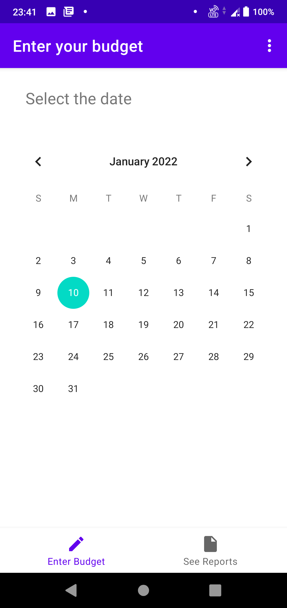
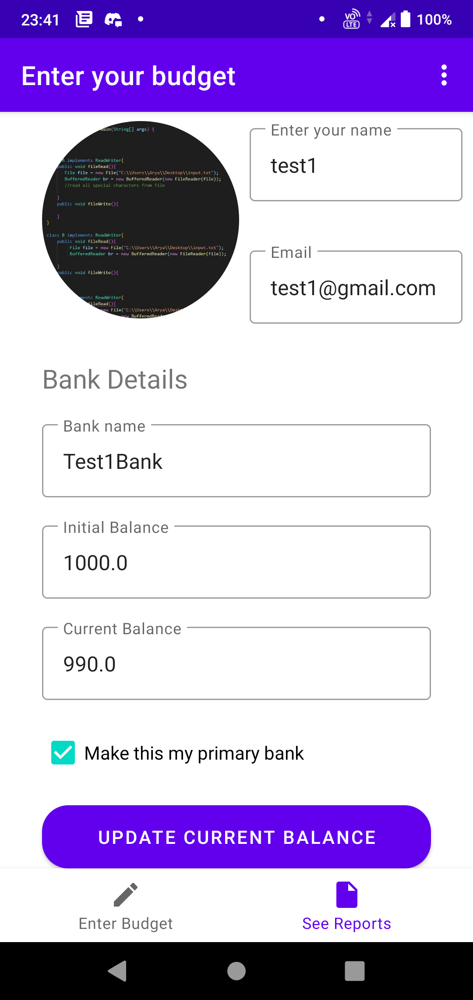
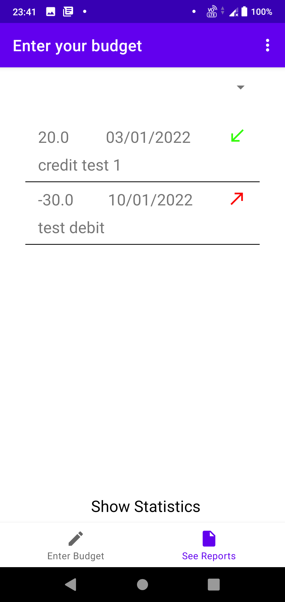
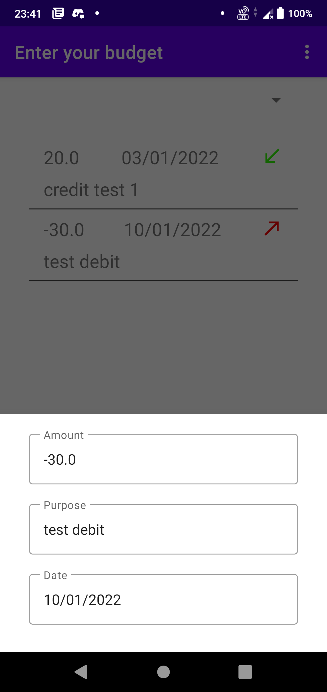
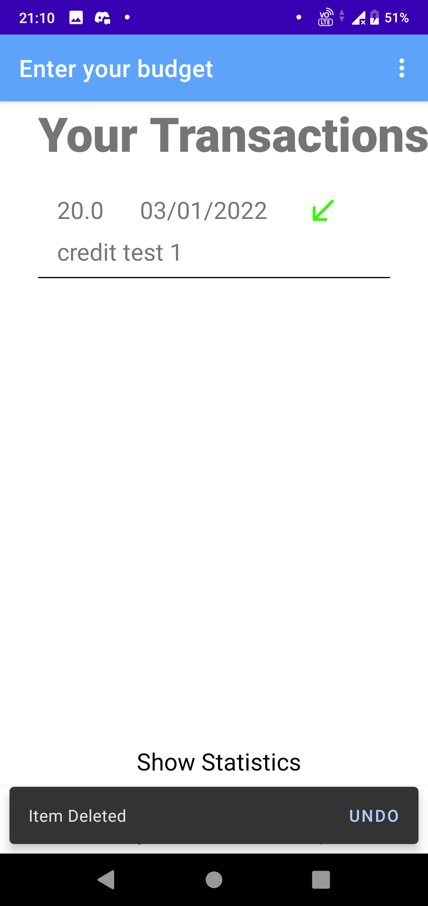

# AccountMe 
> The app “AccountMe” which we have made was made by keeping in mind the necessity of it to the College or University going Students which can help them to Individually track and financially manage their accounts. Therefore all in all it caters to all the areas but specifically to the Individual or Private Solution App category. Our app helps the user in tracing their account transactions where the user first needs to manually add their initial account balance and then enter the credited or debited amount whenever a transaction is being done. The app stores this information in a database and displays it to the user, it also displays the current balance that is the amount left in the account. 

### Problem Statement:

It is always a good idea to manage your finances and we students studying in colleges away from home need an effective and efficient way to manage our expenses. So there was a need to create a personal account and finance management app where the user is able to track his/her spending and accordingly save money.

### Proposed Solution :
This project proposes a solution of “managing and tracking one's own finances”. The app asks the user to create a profile where the user needs to enter their personal details like Name,Email, Bank Name, Initial Account Balance etc. After that, whenever the user does any transactions then he/she only needs to open the app and select the date on which the transaction was done and enter the debited or credited amount. There’s a separate tracking activity/screen for the user to track all the transactions with the label signs of red arrow showing debited and green arrow showing credited. The user can long press to know more about the expenses of the transaction. It also displays the current balance that is the amount left in the account. Lastly, if the user wants to remove a wrong record entry then the user can also delete the transaction record by swiping left or right on that particular record.
 
 ---

### Screenshots : 

  

    

---

### Functionality & Concepts used :

- The App has a very simple, interactive and intuitive user experience which helps the user in tracking and managing the transactions. Following are few android concepts used to achieve the functionalities in app :
> - _Layouts :_ We used an amalgamation of Constraint Layout and ScrollView in our app.
> - _Simple & Easy Views Design :_ Used material design concepts and guidelines to make the app look good. Some of the views we used were  
> - _textfield.TextInputLayout :_ To get the input from users and to display our text.
> - _Spinners :_ As a drop down menu for choosing between debit/credit.
> - _CalendarView :_ For the user to choose the date on which transaction happened.
> - _Snackbars :_ Notify the user when the entry was successful.
> - _ImageView :_ To choose and display the user’s profile photo.
> - _RecyclerView :_ To present the list of transactions made by the user.

- **Navigation Library :** We used the Navigation Component and Navigation Graph to move between the screens and fragments. Apart from that we also have a “Bottom Navigation bar to traverse between the fragments where we have used the Navigation Library.
- **MVVM Architecture :** Strictly followed the MVVM architecture by using Livedata to and Viewmodel classes for our application. The BudgetViewModel and the ProfileViewModel are used to display the data after inserting and fetching it from the database. We used Livedata to update the entries of our ViewModel classes. 
- **Room Database :** We are using the Room Database to store all the transactions in the table form and then displaying them in a fragment through the recycler view. We are using INSERT and SELECT statements to perform the necessary queries for adding and fetching the data. 
- **Coroutines :** We have also used the basic concept of coroutines to do some tasks asynchronously in the background like fetching the image and displaying the records. 
- **Dagger Hilt :** We used the Hilt library for applying Dependency Injection concepts here. The DataAccess Object classes created for the Room Database are like dependencies which are needed again and again in the code therefore injecting those dependencies through the constructors. 

---

### Application Links : [Drive Link for apk](https://drive.google.com/drive/folders/1uMAxgcYmxRncpf8cqPuwE6KFDNhAXcwD?usp=sharing)

---

### Future Scope :  
In the future we are going to add the following things -

> - Add an option to filter the entries of the transactions.
> - Add functionality to create a profile for more than one bank system. 
> - Make the app more interactive by gamifying the user experience to make the user spend less and save more. We will do this by having a monthly target of expenditure and motivate the user to fulfill that goal. We will do this by using Work Manager things to provide the user with weekly notifications, messages and congratulating when the user achieves the set target. 
> - Make the app more user friendly and more colorful with basic UI/UX improvements. 
